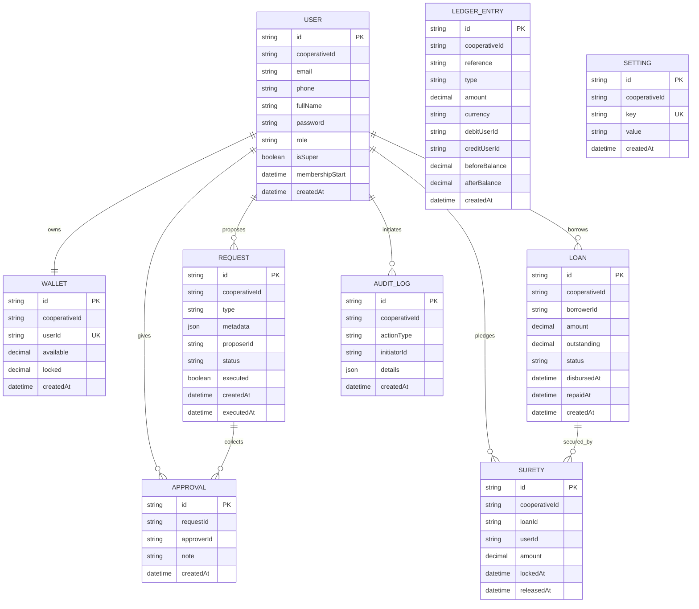

# Prompt 003: Domain Model & Core Entities

## Status
COMPLETED

## Completed At
2026-07-22T12:00:00Z

## Summary
Documents the platform’s core entities, responsibilities, key relationships, and target ER model for implementation in Prisma/PostgreSQL.

## Domain Overview
The cooperative platform centers on members, wallets, governed requests, approvals, loans, sureties, ledger entries, and audit logs. The model separates:
- identity and access control,
- monetary state,
- governance workflow,
- loan collateralization,
- operational traceability.

## Entity Definitions

### User
Represents a cooperative member or administrator.

**Key fields**
- `id`
- `email` or `phone`
- `fullName`
- `password` (bcrypt hash)
- `role` (`MEMBER`, `ADMIN`)
- `isSuper` (platform-level elevation)
- `membershipStart`
- `createdAt`
- target: `cooperativeId`

**Responsibilities**
- authenticate into the system,
- own one wallet,
- propose requests,
- cast approvals when authorized,
- borrow loans,
- pledge surety.

### Wallet
Represents a member’s financial position.

**Key fields**
- `id`
- `userId`
- `available`
- `locked`
- `createdAt`
- target: `cooperativeId`

**Rules**
- one wallet per user,
- `available` is spendable balance,
- `locked` is reserved for surety or governed holds,
- balances change only through domain services.

### LedgerEntry
Represents an immutable financial posting.

**Key fields**
- `id`
- `reference`
- `type`
- `amount`
- `currency`
- `debitUserId`
- `creditUserId`
- `beforeBalance`
- `afterBalance`
- `createdAt`
- target: `cooperativeId`

**Rules**
- append-only,
- uniquely constrained by `(reference, type)`,
- ties technical execution to business intent.

### Request
Represents a governance-controlled action awaiting approval and possible execution.

**Key fields**
- `id`
- `cooperativeId`
- `type`
- `metadata`
- `proposerId`
- `status`
- `executed`
- `createdAt`
- `executedAt`

**Examples**
- transfer request,
- administrative payout,
- loan approval request,
- settings change request.

### Approval
Represents a single admin decision on a request.

**Key fields**
- `id`
- `requestId`
- `approverId`
- `note`
- `createdAt`
- target: `cooperativeId` or derivation from request

**Rules**
- one approval per approver per request,
- proposer cannot approve own request,
- rejection and approval must be explicit actions.

### Loan
Represents a borrower obligation.

**Key fields**
- `id`
- `borrowerId`
- `amount`
- `outstanding`
- `disbursedAt`
- `repaidAt`
- `createdAt`
- target: `status`, `cooperativeId`, optional terms metadata

**Rules**
- starts created,
- disburses only after surety conditions are met,
- outstanding decreases with repayment,
- repayment completion sets `repaidAt`.

### Surety
Represents collateral pledged by a member against a loan.

**Key fields**
- `id`
- `loanId`
- `userId`
- `amount`
- `lockedAt`
- `releasedAt`
- target: `cooperativeId`

**Rules**
- pledge locks wallet funds,
- release restores wallet liquidity,
- active sureties are those with `releasedAt IS NULL`.

### AuditLog
Represents immutable operational evidence.

**Key fields**
- `id`
- `actionType`
- `initiatorId`
- `details`
- `createdAt`
- target: `cooperativeId`

**Purpose**
- security review,
- operational debugging,
- compliance investigation,
- after-the-fact reconstruction.

### Setting
Represents dynamic configuration.

**Key fields**
- `id`
- `key`
- `value`
- `createdAt`
- target: `cooperativeId` for tenant-level settings where appropriate

**Examples**
- approval threshold,
- loan policy values,
- system toggles.

## Relationship Rules
- One `User` has one `Wallet`.
- One `User` proposes many `Request` rows.
- One `Request` has many `Approval` rows.
- One `Approval` belongs to one `User` approver and one `Request`.
- One `User` may borrow many `Loan` rows.
- One `Loan` may have many `Surety` rows.
- One `User` may provide many `Surety` rows.
- One `User` may initiate many `AuditLog` rows.
- One `Request` may result in multiple `LedgerEntry` rows through execution.

## Mermaid ER Diagram

## Implementation Notes
- Current schema already includes the primary entities listed above.
- The request-driven docs assume target normalization and schema hardening where fields such as `cooperativeId`, explicit loan `status`, and richer request metadata may be added.
- All money values should remain `Decimal` in Prisma and never be processed as floating-point values in business logic.
