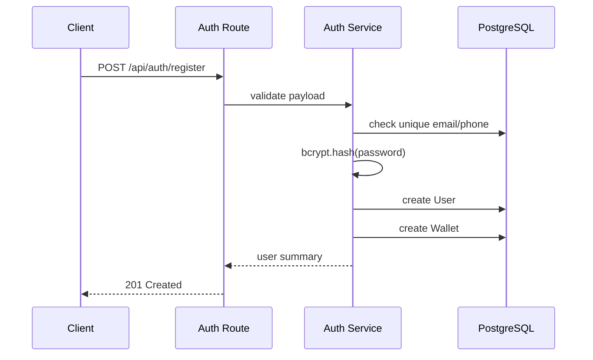
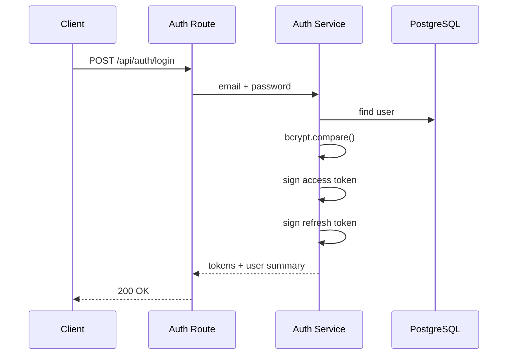
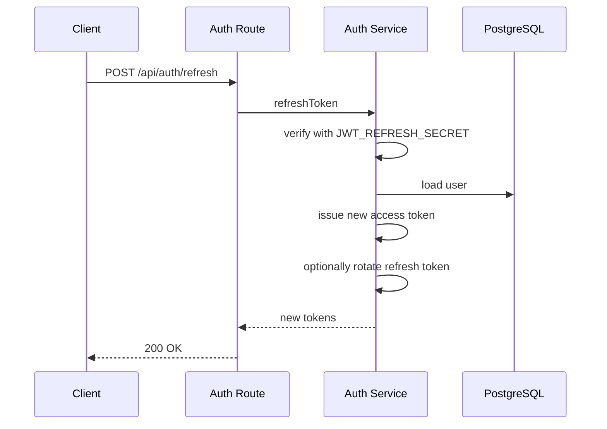

# Prompt 004: Authentication & Authorization Architecture

## Status
COMPLETED

## Completed At
2026-07-22T12:00:00Z

## Summary
Defines token-based authentication, RBAC, registration/login/refresh flows, and middleware design for Express.js services.

## Architecture Goals
- Stateless API authentication.
- Short-lived access, longer-lived refresh.
- Clear separation of identity verification and authorization.
- Role- and tenant-aware route protection.
- Safe defaults for all protected endpoints.

## Token Model

### Access Token
- Format: JWT
- Lifetime: `15m`
- Secret: `JWT_SECRET`
- Claims:
  - `sub`: user id
  - `role`: `MEMBER` or `ADMIN`
  - target add: `isSuper`, `cooperativeId`, token version if revocation is needed

### Refresh Token
- Format: JWT
- Lifetime: `30d`
- Secret: `JWT_REFRESH_SECRET`
- Claims:
  - `sub`: user id
  - target add: `tokenFamilyId`, `jti`, rotation metadata

## RBAC Model

### MEMBER
Can:
- register and login,
- view own profile,
- view own wallet,
- withdraw own funds where policy allows,
- propose requests,
- view own loans,
- repay own loans,
- pledge surety subject to policy.

Cannot:
- approve governed requests,
- release arbitrary sureties,
- deposit funds into arbitrary wallets,
- act outside own tenant scope.

### ADMIN
Can:
- do everything a member can within cooperative scope,
- deposit under policy,
- approve or reject requests,
- disburse loans,
- release surety when conditions allow,
- view broader cooperative operational records as permitted.

Cannot:
- approve or reject own request,
- bypass approval thresholds,
- access another cooperative’s data.

### SUPER
Conceptual top-level operator role. In current implementation this is represented as `isSuper=true` overlaying role checks.

Can:
- perform break-glass support,
- access cross-tenant operational tooling when explicitly authorized,
- manage system-level settings.

Must:
- be heavily audited,
- be excluded from routine business paths where possible.

## Registration Flow

### Registration Rules
- Require password and at least one unique identifier (`email` or `phone`).
- Reject duplicate email or phone with `409 Conflict`.
- Hash password with bcrypt before persistence.
- Create wallet immediately after user creation.
- Default role is `MEMBER`.

## Login Flow

### Login Rules
- Reject missing credentials with `400 Bad Request`.
- Reject invalid email/password with `401 Unauthorized`.
- Never disclose whether email or password was wrong.
- Return both access and refresh tokens.

## Token Refresh Flow

### Refresh Requirements
- Add `/api/auth/refresh` endpoint.
- Verify with refresh secret only.
- Return new access token; optionally rotate refresh token on every use.
- Reject expired or invalid refresh token with `401`.
- Consider storing refresh token family metadata for revocation in future versions.

## Middleware Design

### `authenticate`
Responsibilities:
- extract bearer token,
- verify JWT,
- load current user from database,
- attach user to `req.user`,
- fail closed on any error.

### `ensureRole(role)`
Responsibilities:
- require authenticated user,
- allow matching role,
- allow `isSuper` override,
- return `403 Forbidden` when insufficient.

### Target `ensureAnyRole(...roles)`
Recommended extension for routes with multiple acceptable roles.

### Target `enforceTenantScope`
Recommended middleware to:
- compare route/query/body `cooperativeId` to authenticated tenant,
- scope service input automatically,
- reject cross-tenant access with `403` or `404`.

## Route Protection Matrix
- `/api/auth/register` → public
- `/api/auth/login` → public
- `/api/auth/refresh` → public with refresh token
- `/api/wallets/balance` → authenticated member
- `/api/wallets/deposit` → admin
- `/api/wallets/withdraw` → authenticated member acting on self
- `/api/requests/*` → authenticated
- `/api/approvals/:requestId` → admin
- `/api/loans/:id/disburse` → admin
- `/api/surety/release` → admin

## Implementation Notes
- Keep token signing in a dedicated auth module.
- Avoid embedding mutable authorization state that cannot be rechecked.
- Prefer DB-backed user lookup after token verification so disabled users can be rejected.
- Add audit events for login, refresh, and privileged authorization failures in future hardening.
