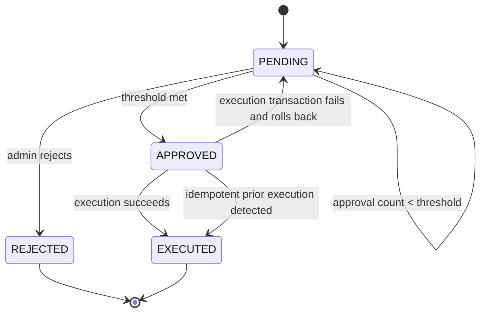

# Prompt 005: Approval Workflow State Machine Design

## Status
COMPLETED

## Completed At
2026-07-22T12:00:00Z

## Summary
Defines the governed request lifecycle, approval threshold logic, rejection behavior, and single-winner execution guards for cooperative actions.

## Workflow Purpose
The approval workflow ensures high-impact cooperative actions are not executed by a single actor without oversight. A `Request` captures proposed intent, `Approval` rows capture admin decisions, and execution occurs only after policy conditions are satisfied.

## Core Lifecycle
- `PENDING`: request created and awaiting admin decisions.
- `APPROVED`: threshold met and request eligible for execution.
- `REJECTED`: an authorized rejection ended the lifecycle.
- `EXECUTED`: side effects completed or were idempotently confirmed.

## State Rules
- A new request always starts as `PENDING`.
- Only admins may approve or reject.
- The proposer cannot approve or reject their own request.
- One approver may record at most one decision per request.
- Once threshold is met, execution must be serialized.
- Once rejected, execution is impossible.
- Once executed, further approvals or retries must not create new side effects.

## Mermaid State Diagram


## Approval Threshold Logic
- Threshold value is read from `Setting(key='approval_threshold')`.
- Default threshold is `2` if not configured.
- Threshold check must happen:
  1. after each recorded approval,
  2. again inside the execution transaction.
- Rechecking inside the transaction prevents races between concurrent approvers.

## Execution Guard Design
Execution must use a transaction with a row lock on the request record.

### Required Steps
1. Load request.
2. Validate request exists and is `PENDING`.
3. Record approval.
4. Count approvals.
5. If threshold not met, stop.
6. If threshold met, open transaction.
7. `SELECT ... FOR UPDATE` on request row.
8. Re-check status, executed flag, and approval count.
9. Check idempotency markers such as existing ledger entries.
10. Execute side effects.
11. Mark request `EXECUTED`, set `executed=true`, `executedAt=now()`.
12. Write audit log.

## Rejection Rules
- Rejection is terminal.
- Rejection must be explicitly recorded with approver, note, and timestamp.
- Rejected requests cannot later become approved or executed.
- Rejection should be idempotent only insofar as duplicate reject attempts must fail once state is no longer `PENDING`.

## Execution Metadata Requirements
Every executable request should include structured metadata such as:
- `action` or `type`,
- involved user ids,
- amount,
- currency,
- optional business identifiers.

Example transfer metadata:
```json
{
  "action": "transfer",
  "fromUserId": "user-a",
  "toUserId": "user-b",
  "amount": "1000"
}
```

## Failure Behavior
- If execution prerequisites fail before side effects, the transaction must roll back completely.
- If duplicate execution is detected by unique ledger constraint, treat it as successful idempotent completion and mark request executed.
- If execution metadata is missing, do not perform financial side effects; audit the condition and decide whether to park, reject, or safely finalize per policy.

## Approval Workflow Pseudocode
```text
approveRequest(requestId, approverId):
  validate approver is admin and not proposer
  validate request.status == PENDING
  create approval if none exists
  if approvalCount < threshold:
    return approval recorded

  transaction:
    lock request row FOR UPDATE
    if request.status != PENDING:
      return already handled
    if request.executed:
      set status EXECUTED if needed
      return
    if approvalCountInsideTx < threshold:
      return
    set status APPROVED
    execute business action
    set status EXECUTED, executed=true, executedAt=now
    write audit
```

## Observability Requirements
Audit at least:
- request creation,
- each approval,
- each rejection,
- threshold reached,
- execution success,
- execution skipped as idempotent,
- execution failure cause where safe.

## Testing Requirements
Must cover:
- proposer cannot approve own request,
- threshold not met after first approval,
- threshold met triggers execution,
- rejection is terminal,
- insufficient funds roll back execution,
- concurrent approvals execute once only.
