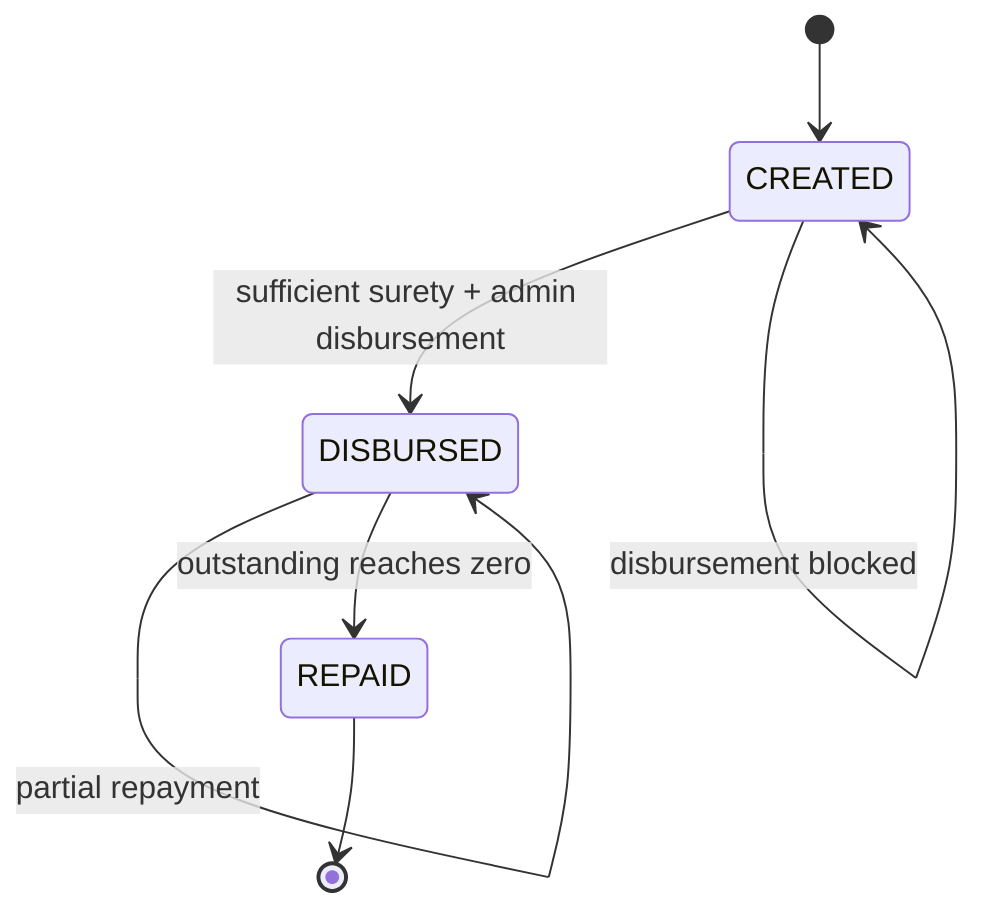

# Prompt 007: Loan Lifecycle Architecture

## Status
COMPLETED

## Completed At
2026-07-22T12:00:00Z

## Summary
Defines the loan lifecycle, state transitions, surety prerequisite, disbursement controls, repayment processing, and completion behavior.

## Business Intent
Loans allow members to access cooperative funds under controlled governance. A loan is not merely a balance transfer; it is a governed obligation requiring collateralization, traceability, and repayment tracking.

## Loan States
Recommended explicit loan states:
- `CREATED` – loan record exists, not yet disbursed.
- `DISBURSED` – borrower has received funds.
- `REPAID` – outstanding balance reached zero.
- optional future: `DEFAULTED`, `CANCELLED`.

In current schema, state can be inferred from timestamps:
- no `disbursedAt` → created
- `disbursedAt` set and `repaidAt` null → disbursed
- `repaidAt` set → repaid

## Lifecycle Diagram


## Create Loan Flow
- Caller provides borrower and amount.
- System creates `Loan` with:
  - `amount`,
  - `outstanding = amount`,
  - `createdAt = now()`,
  - no `disbursedAt`,
  - no `repaidAt`.
- Audit `LOAN_CREATED`.

## Surety Requirement
A loan may only be disbursed when total active surety pledged for the loan is greater than or equal to the loan amount.

### Validation Rule
```text
SUM(active surety amounts for loan) >= loan.amount
```

### Active Surety Definition
A surety is active when `releasedAt IS NULL`.

## Disbursement Flow
1. Load loan.
2. Reject if missing.
3. Reject if already disbursed.
4. Aggregate active surety amount.
5. Reject if pledged amount is insufficient.
6. In one transaction:
   - credit borrower wallet,
   - write `LOAN_DISBURSE` ledger row,
   - set `disbursedAt`,
   - ensure `outstanding` is correct,
   - write `LOAN_DISBURSED` audit log.

## Disbursement Guards
- Admin-only route.
- Must be idempotent against duplicate invocation.
- Must not disburse twice.
- Must fail if borrower wallet is missing.
- Must be tenant-scoped.

## Repayment Flow
1. Load loan.
2. Reject if not found.
3. Reject if not disbursed.
4. Validate amount > 0.
5. In one transaction:
   - debit borrower wallet if `available >= amount`,
   - write `LOAN_REPAY` ledger row,
   - reduce `outstanding`,
   - set `repaidAt` when outstanding reaches zero,
   - write `LOAN_REPAID` audit event.
6. If fully repaid, release all active sureties.

## Partial Repayment Rules
- Partial repayments are allowed.
- `outstanding` decreases by the repaid amount.
- Loan remains active until `outstanding <= 0`.
- Overpayment should be blocked or normalized by repayment cap in future hardening.

## Full Repayment Completion
When `outstanding <= 0`:
- set `outstanding = 0`,
- set `repaidAt = now()`,
- release all active sureties,
- write audit entries for each release.

## Surety Release on Completion
For each active surety:
1. Move amount from `locked` to `available` on surety provider wallet.
2. Write `SURETY_RELEASE` ledger row.
3. Set `releasedAt`.
4. Audit `SURETY_RELEASED`.

## Failure Handling
- If borrower lacks funds for repayment, reject before updating loan state.
- If surety release for one provider fails during repayment completion, the transaction policy should ideally fail the full transaction; if partial continuation is intentionally chosen, it must be heavily audited and reconciled.
- Any partial side-effect path must be avoided unless explicitly designed.

## Recommended Schema Evolution
- Add explicit `status` enum to `Loan`.
- Add `cooperativeId`.
- Add optional `approvedRequestId` if loans become approval-driven.
- Add term, interest, repayment schedule metadata as structured fields rather than ad hoc JSON.

## Testing Requirements
Must cover:
- cannot disburse with insufficient surety,
- can disburse once sufficient surety exists,
- borrower wallet credited on disbursement,
- partial repayment preserves active loan,
- full repayment sets `repaidAt`,
- sureties release on full repayment,
- repayment fails on insufficient funds.
