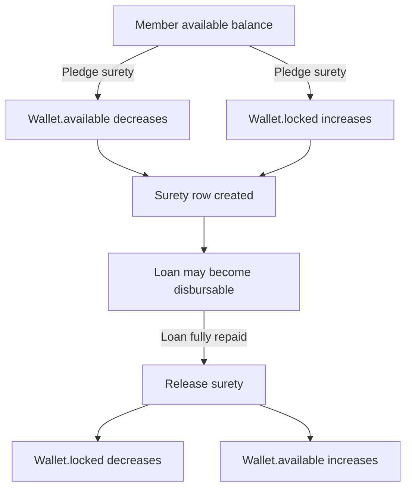

# Prompt 008: Surety Mechanism Design

## Status
COMPLETED

## Completed At
2026-07-22T12:00:00Z

## Summary
Defines the purpose of surety, lock-and-release rules, wallet treatment of pledged funds, loan relationships, and operational edge cases.

## What Surety Is
Surety is member-provided financial backing for a borrower’s loan. A surety provider commits part of their wallet balance as collateral. The funds remain owned by the provider but become unavailable for spending until release.

## Domain Intent
The surety model ensures that:
- loans are not disbursed without backing,
- collateral is visible and auditable,
- members cannot over-pledge beyond available funds,
- release occurs only under defined conditions.

## Core Surety Fields
- `loanId`
- `userId`
- `amount`
- `lockedAt`
- `releasedAt`
- target: `cooperativeId`

## Pledge Rules
- A surety pledge requires:
  - valid loan,
  - valid member wallet,
  - positive amount,
  - sufficient `available` balance.
- Pledge operation must atomically move funds:
  - `available -= amount`
  - `locked += amount`
- A `Surety` row is created only if wallet lock succeeds.
- A `SURETY_PLEDGE` ledger entry and `SURETY_PLEDGED` audit log must be written.

## Locked vs Available Balance

### Available Balance
- spendable funds,
- usable for withdrawal, transfers, and new surety pledges.

### Locked Balance
- reserved funds,
- not spendable,
- used as collateral backing,
- released back to available when policy conditions are satisfied.

## Loan-Surety Relationship
- One loan may have multiple surety providers.
- One member may pledge surety for multiple loans if available balance permits.
- Disbursement eligibility depends on total active surety for the loan.

## Release Conditions
Surety may be released when one of the following policy-approved events occurs:
- the loan is fully repaid,
- the loan is cancelled before disbursement,
- an admin performs an authorized manual release under controlled policy,
- an incident repair procedure explicitly compensates the pledge.

## Release Rules
- A surety already released cannot be released again.
- Release operation must atomically move funds:
  - `locked -= amount`
  - `available += amount`
- Release must set `releasedAt`.
- Release must emit `SURETY_RELEASE` ledger and `SURETY_RELEASED` audit events.

## Edge Cases

### Insufficient Balance During Pledge
If `available < amount`, reject with `400` and create no surety row.

### Double Release
If `releasedAt` is already set, reject as invalid state.

### Partial Release
If policy supports partial release, model it explicitly. Current simple model marks a surety row released once the release occurs; for true partial release, introduce:
- `originalAmount`,
- `releasedAmount`,
- `status`,
- or multiple child release entries.

### Over-Collateralization
Loan disbursement may allow total surety > loan amount. Policy should define whether excess is permitted or capped.

### Concurrent Pledges
Use atomic wallet updates so multiple simultaneous pledges cannot overdraw available balance.

### Loan Repayment Completion
If multiple sureties exist, release all active rows within a controlled transactional workflow.

## Mermaid Flow

## Query Patterns
- Active sureties by loan: `where loanId = ? and releasedAt is null`
- Sureties by user: `where userId = ?`
- Collateral sufficiency: aggregate active surety amounts by loan
- Released history: `where releasedAt is not null`

## Recommended Hardening
- Add foreign-key relations in Prisma for `Surety -> Loan` and `Surety -> User` if not already modeled explicitly.
- Add `cooperativeId`.
- Consider unique business references for surety pledge/release operations.
- Consider explicit surety status enum for richer lifecycle handling.
