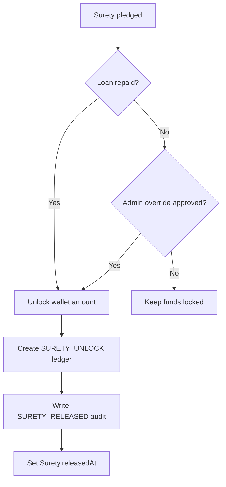

# Prompt 037: Surety Release Module

## Status
COMPLETED

## Completed At
2026-07-22T12:00:00Z

## Summary
Defined the surety release flow for unlocking pledged collateral after a loan is fully repaid or when an administrator performs an override. The design covers wallet unlock logic, ledger/audit writes, and surety state updates.

## Core Function
The release entry point is `releaseSurety()` in `src/modules/surety.js`. It loads the surety record, prevents double release, moves the pledged amount from `Wallet.locked` back to `Wallet.available`, records the financial event, and stamps `Surety.releasedAt`.

```js
async function releaseSurety({ initiatorId = null, suretyId, amount = null, reference = 'SURETY_RELEASE' }) {
  const s = await prisma.surety.findUnique({ where: { id: suretyId } });
  if (!s) throw Object.assign(new Error('Surety not found'), { status: 404 });
  if (s.releasedAt) throw Object.assign(new Error('Surety already released'), { status: 400 });

  const releaseAmount = amount ? String(amount) : String(s.amount);
  const rows = await prisma.$queryRaw`
    UPDATE "Wallet"
    SET "locked" = "locked" - ${releaseAmount}, "available" = "available" + ${releaseAmount}
    WHERE "userId" = ${s.userId} AND "locked" >= ${releaseAmount}
    RETURNING *;
  `;

  await prisma.surety.update({ where: { id: suretyId }, data: { releasedAt: new Date() } });
}
```

## Release Conditions
1. **Automatic release on repayment**: once a loan balance reaches zero in `repayLoan()`, all unreleased sureties for that loan are iterated and released.
2. **Admin override**: an admin-only route can call `releaseSurety()` directly when a manual exception is approved.
3. **Guard rails**:
   - surety must exist;
   - surety must not already be released;
   - wallet must still contain enough locked funds.

## Wallet and Ledger Effects
Release moves value from locked to available without changing total wallet holdings.

- `Wallet.locked -= releaseAmount`
- `Wallet.available += releaseAmount`
- ledger record created for traceability

Recommended ledger typing for the module:
- financial type: `SURETY_UNLOCK`
- reference: `SURETY_RELEASE` or loan/surety reference
- credit side: surety owner

```js
await prisma.ledgerEntry.create({
  data: {
    reference,
    type: 'SURETY_UNLOCK',
    amount: releaseAmount,
    currency: 'NGN',
    debitUserId: null,
    creditUserId: s.userId,
    beforeBalance: String(Number(updated.available) - Number(releaseAmount)),
    afterBalance: String(updated.available),
  },
});
```

## Audit Trail
Every release is written to the audit stream with action type `SURETY_RELEASED`.

```js
await logAudit('SURETY_RELEASED', initiatorId, {
  suretyId,
  loanId: s.loanId,
  userId: s.userId,
  amount: releaseAmount,
  reason: 'loan repaid or admin override',
});
```

## State Transition


## API Shape
Recommended admin endpoint:

```http
POST /api/sureties/release
Authorization: ******
Content-Type: application/json

{
  "suretyId": "uuid",
  "amount": "2000",
  "reason": "admin override"
}
```

Success response:

```json
{
  "suretyId": "uuid",
  "userId": "uuid",
  "amount": "2000",
  "releasedAt": "2026-07-22T12:00:00.000Z"
}
```

## Implementation Notes
- Keep the wallet update atomic with SQL or a Prisma transaction.
- Prefer full release by default; partial release should be explicitly justified.
- When invoked from `repayLoan()`, use the loan id as the reference for easier reconciliation.
