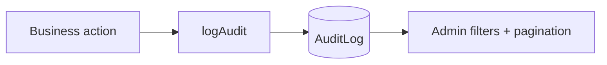

# Prompt 038: Audit Log Module

## Status
COMPLETED

## Completed At
2026-07-22T12:00:00Z

## Summary
Documented the audit logging subsystem used for operational and financial traceability. The module defines a write helper, immutable storage model, filtered retrieval, and admin-only access patterns.

## AuditLog Model
The Prisma model persists append-only security and business events.

```prisma
model AuditLog {
  id          String   @id @default(uuid())
  actionType  String
  initiatorId String?
  details     Json
  createdAt   DateTime @default(now())
}
```

## Write API
`logAudit(actionType, initiatorId, details)` is the standard write helper in `src/modules/audit.js`.

```js
async function logAudit(actionType, initiatorId = null, details = {}) {
  try {
    await prisma.auditLog.create({
      data: { actionType, initiatorId, details },
    });
  } catch (err) {
    console.error('Failed to write audit log', err);
  }
}
```

## Action Type Catalogue
Recommended enum-style values:
- `WALLET_DEPOSIT`
- `WALLET_WITHDRAW`
- `WALLET_LOCK`
- `WALLET_UNLOCK`
- `SURETY_PLEDGED`
- `SURETY_RELEASED`
- `LOAN_CREATED`
- `LOAN_DISBURSED`
- `LOAN_REPAY`
- `REQUEST_CREATED`
- `REQUEST_APPROVED`
- `REQUEST_REJECTED`
- `REQUEST_THRESHOLD_MET`
- `REQUEST_EXECUTED`
- `REQUEST_EXECUTION_SKIPPED`
- `REQUEST_EXECUTION_IDEMPOTENT`
- `AUTH_REGISTERED`
- `AUTH_LOGIN_SUCCESS`
- `SETTING_UPDATED`
- `MEMBER_DEACTIVATED`

## Read API
Recommended service method:

```js
async function getAuditLogs({
  actionType,
  initiatorId,
  dateFrom,
  dateTo,
  page = 1,
  pageSize = 20,
}) {
  const where = {
    ...(actionType ? { actionType } : {}),
    ...(initiatorId ? { initiatorId } : {}),
    ...(dateFrom || dateTo
      ? { createdAt: { ...(dateFrom ? { gte: new Date(dateFrom) } : {}), ...(dateTo ? { lte: new Date(dateTo) } : {}) } }
      : {}),
  };

  const [data, total] = await prisma.$transaction([
    prisma.auditLog.findMany({ where, orderBy: { createdAt: 'desc' }, skip: (page - 1) * pageSize, take: pageSize }),
    prisma.auditLog.count({ where }),
  ]);

  return { data, total, page, pageSize };
}
```

## Access Control
Audit visibility is admin-only because the table can expose security-sensitive metadata.

```js
router.get('/audit-logs', authenticate, ensureRole('ADMIN'), async (req, res, next) => {
  try {
    res.json(await getAuditLogs(req.query));
  } catch (err) {
    next(err);
  }
});
```

## Immutability Rules
- audit rows are append-only;
- no update endpoint;
- no delete endpoint in runtime APIs;
- cleanup may happen only in test fixtures or controlled archival jobs.



## Pagination Contract
Use a stable response envelope:

```json
{
  "data": [],
  "total": 142,
  "page": 1,
  "pageSize": 20
}
```

## Operational Notes
- Keep `details` JSON small but meaningful.
- Store ids, amounts, references, and reasons rather than full object snapshots.
- If write failure should never block user flows, log the error and continue as the current helper does.
