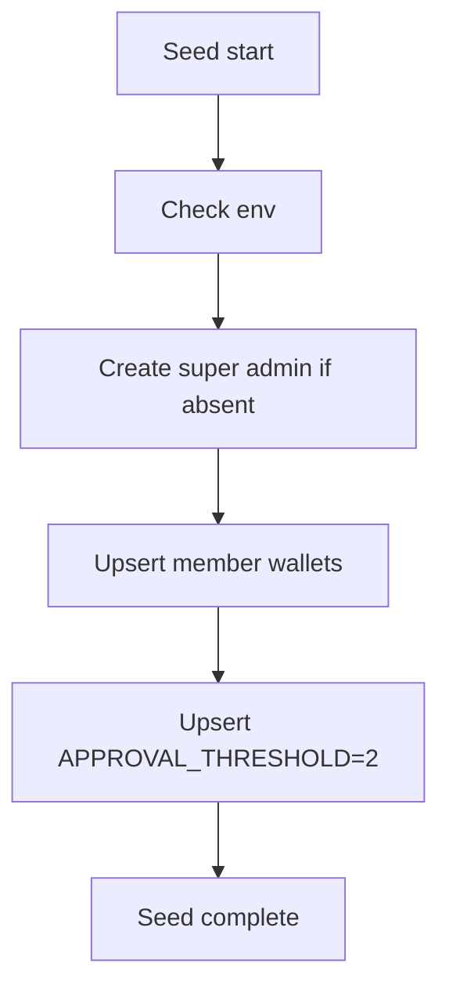

# Prompt 040: Seed Data Module

## Status
COMPLETED

## Completed At
2026-07-22T12:00:00Z

## Summary
Defined the seed strategy for bootstrapping development and test environments. The seed flow provisions a super admin, sample members, wallets, and baseline settings while remaining safe to rerun.

## Seed Entry Script
The seed module lives in `src/modules/seed.js`. The current implementation already creates a development super admin and wallet from environment variables.

```js
async function seedSuperAdmin() {
  const email = process.env.DEV_ADMIN_EMAIL;
  const password = process.env.DEV_ADMIN_PASSWORD;
  if (!email || !password) return;

  const existing = await prisma.user.findUnique({ where: { email } });
  if (existing) return;

  const hashed = await bcrypt.hash(password, 10);
  const user = await prisma.user.create({
    data: {
      email,
      fullName: 'Dev Super Admin',
      password: hashed,
      role: 'ADMIN',
      isSuper: true,
      membershipStart: new Date(),
    },
  });

  await prisma.wallet.create({ data: { userId: user.id, available: 0, locked: 0 } });
}
```

## Full Seed Design
Target `seed.js` behavior:
1. clean test-only tables where appropriate;
2. create super admin;
3. create sample admin and member accounts;
4. create wallets for every seeded user;
5. initialize settings, especially `APPROVAL_THRESHOLD=2`.

```js
await prisma.setting.upsert({
  where: { key: 'APPROVAL_THRESHOLD' },
  update: { value: '2' },
  create: { key: 'APPROVAL_THRESHOLD', value: '2' },
});
```

## Cleanup Strategy
Use `prisma.$executeRaw` carefully for deterministic resets in local/test environments only.

```js
await prisma.$executeRawUnsafe('TRUNCATE TABLE "Approval", "Request", "LedgerEntry", "Surety", "Loan" RESTART IDENTITY CASCADE');
```

Guidelines:
- never run destructive cleanup in production;
- prefer environment guards such as `NODE_ENV !== 'production'`;
- keep truncation order explicit or use `CASCADE`.

## Idempotent Seed Design
The seed should be rerunnable without duplicate rows.

Patterns:
- `findUnique()` before create;
- `upsert()` for settings and wallets;
- stable emails/phones for seeded users;
- no random duplicates unless the dataset is intentionally ephemeral.



## Recommended Sample Dataset
- 1 super admin
- 2 admins
- 3 members
- funded wallets for transfer/loan smoke tests
- baseline settings

## Operational Notes
- Hash passwords with bcrypt.
- Store seed logic in one module and invoke through Prisma seed or npm script.
- Emit concise console output for each created or skipped record.
