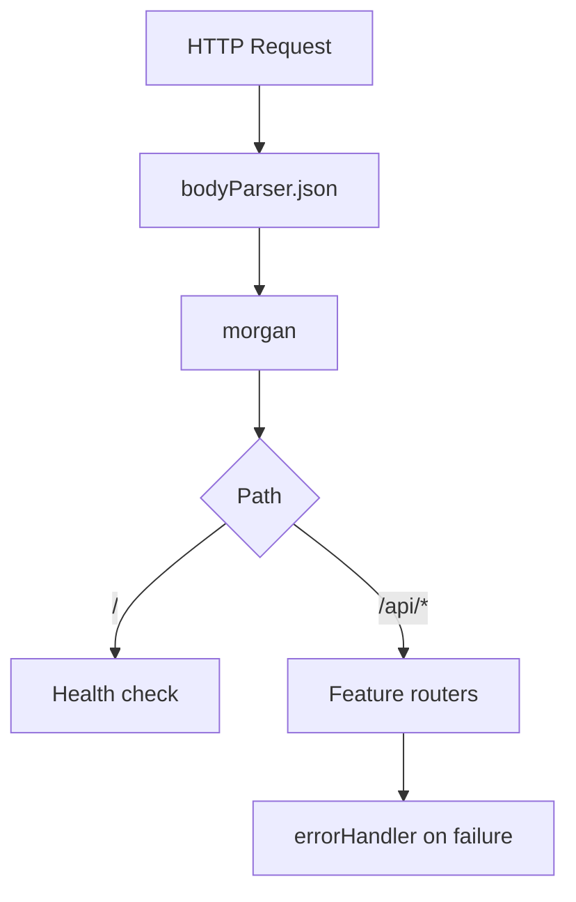

# Prompt 041: Express Server Setup

## Status
COMPLETED

## Completed At
2026-07-22T12:00:00Z

## Summary
Documented the Express application bootstrap, including middleware order, route mounting under `/api`, error handling, environment-driven port selection, and a simple health check endpoint.

## Server Architecture
The runtime entry point is `src/server.js`.

```js
const express = require('express');
const bodyParser = require('body-parser');
const morgan = require('morgan');
const routes = require('./routes');
const { errorHandler } = require('./middleware/errorHandler');

const PORT = process.env.PORT || 3000;
const app = express();

app.use(bodyParser.json());
app.use(morgan('dev'));
app.get('/', (req, res) => res.status(200).send('Cooperative App Running
'));
app.use('/api', routes);
app.use(errorHandler);

app.listen(PORT, () => console.log(`Server is running on port ${PORT}`));
```

## Middleware Stack
Order matters:
1. JSON body parsing (`bodyParser.json()`)
2. request logging (`morgan('dev')`)
3. health endpoint (`GET /`)
4. feature routers mounted under `/api`
5. global error handler

## Health Check
The root endpoint is a lightweight liveness probe.

```http
GET /
200 OK
Cooperative App Running
```

## Route Mounting
All application features are mounted under `/api` so external consumers have a consistent base path.



## PORT Configuration
The port is driven by `process.env.PORT` with a `3000` fallback.

Recommended env set:

```env
PORT=3000
JWT_SECRET=change-me
JWT_REFRESH_SECRET=change-me-too
DATABASE_URL=postgresql://...
```

## Implementation Notes
- Export `app` separately from `listen()` if supertest-based HTTP integration tests are added.
- Keep the global error handler last.
- Consider `express.json()` as a future simplification if `body-parser` is removed.
