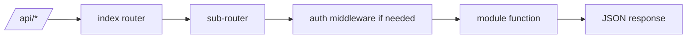

# Prompt 042: Route Architecture

## Status
COMPLETED

## Completed At
2026-07-22T12:00:00Z

## Summary
Documented the modular route architecture that mounts domain-specific sub-routers below `/api`. The design centralizes route registration and applies authentication/authorization per feature boundary.

## Root Router
`src/routes/index.js` composes the route tree.

```js
const router = express.Router();
router.use('/auth', authRoutes);
router.use('/wallets', walletRoutes);
router.use('/requests', requestRoutes);
router.use('/approvals', approvalRoutes);
router.use('/surety', suretyRoutes);
router.use('/loans', loansRoutes);
```

For public documentation, the surety area can be described as the **sureties module** even if the current mount path is singular.

## Route Map
- `/api/auth` - registration and login
- `/api/wallets` - balances, deposits, withdrawals, locks, unlocks
- `/api/loans` - creation, listing, disbursement, repayment
- `/api/sureties` - pledge and release operations
- `/api/requests` - proposal lifecycle
- `/api/approvals` - approve or reject requests

## Protection Pattern
Middleware is attached at route-level rather than globally so public auth endpoints remain accessible.

```js
router.get('/balance', authenticate, async (req, res, next) => { ... });
router.post('/deposit', authenticate, ensureRole('ADMIN'), async (req, res, next) => { ... });
```

## Router Segmentation Rules
- keep business logic inside `src/modules/*`;
- keep routers thin and HTTP-focused;
- use `next(err)` to forward failures;
- validate required fields before module invocation.

## Request Flow


## Recommended File Layout
```text
src/routes/
  index.js
  auth.js
  wallets.js
  loans.js
  surety.js
  requests.js
  approvals.js
```

## Implementation Notes
- Add new feature areas as separate routers to keep diffs localized.
- Apply `ensureRole('ADMIN')` only where privileged actions are required.
- Keep URL nouns plural for future consistency where possible.
