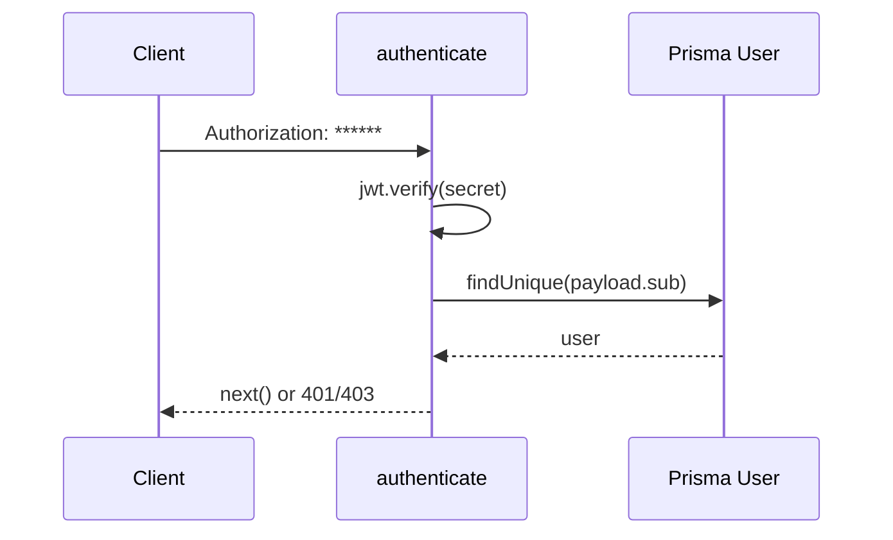

# Prompt 043: Auth Middleware

## Status
COMPLETED

## Completed At
2026-07-22T12:00:00Z

## Summary
Documented the JWT-based authentication middleware that protects private routes, resolves the acting user, and supports admin/super-admin authorization checks.

## authenticate Middleware
The middleware expects a ****** and verifies it with the access-token secret.

```js
async function authenticate(req, res, next) {
  const auth = req.headers.authorization;
  if (!auth || !auth.startsWith('Bearer ')) {
    return res.status(401).json({ error: 'Unauthorized' });
  }

  const token = auth.split(' ')[1];
  const payload = jwt.verify(token, process.env.JWT_SECRET);
  const user = await prisma.user.findUnique({ where: { id: payload.sub } });
  if (!user) return res.status(401).json({ error: 'Unauthorized' });

  req.user = user;
  return next();
}
```

## Token Claims
Expected access-token claims:
- `sub`: user id
- `role`: `MEMBER` or `ADMIN`
- optional future claims: `isSuper`, `permissions`, `sessionId`

Even when `role` is in the token, the database lookup remains important so suspended/deleted users are rejected.

## Authorization Helpers
Current role enforcement is handled by `ensureRole(role)`.

```js
function ensureRole(role) {
  return function (req, res, next) {
    if (!req.user) return res.status(401).json({ error: 'Unauthorized' });
    if (req.user.role !== role && !req.user.isSuper) {
      return res.status(403).json({ error: 'Forbidden' });
    }
    return next();
  };
}
```

Recommended convenience wrappers:

```js
const isAdmin = ensureRole('ADMIN');
function isSuper(req, res, next) {
  if (!req.user?.isSuper) return res.status(403).json({ error: 'Forbidden' });
  return next();
}
```

## Failure Cases
- missing header -> `401 Unauthorized`
- malformed header -> `401 Unauthorized`
- invalid signature / expired token -> `401 Invalid token`
- valid token for deleted user -> `401 Unauthorized`
- insufficient role -> `403 Forbidden`

## Flow Diagram


## Implementation Notes
- Keep access and refresh secrets separate.
- Avoid trusting only the token payload for privileged access.
- Attach the full user object as `req.user` for downstream route handlers.
