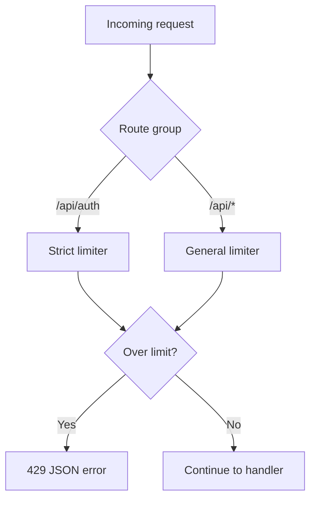

# Prompt 046: Rate Limiting

## Status
COMPLETED

## Completed At
2026-07-22T12:00:00Z

## Summary
Defined a rate-limiting strategy for protecting public and authenticated endpoints. The design uses `express-rate-limit` with stricter controls around authentication and optional per-user limits for sensitive actions.

## Strategy
Apply layered limits:
1. **per-IP** for all public traffic;
2. **stricter per-IP** on `/api/auth/*` to slow brute force;
3. **per-user** for authenticated money-moving endpoints.

## Integration Plan
```js
const rateLimit = require('express-rate-limit');

const authLimiter = rateLimit({
  windowMs: Number(process.env.RATE_LIMIT_AUTH_WINDOW_MS || 15 * 60 * 1000),
  max: Number(process.env.RATE_LIMIT_AUTH_MAX || 10),
  standardHeaders: true,
  legacyHeaders: false,
  message: { error: 'Too many requests, please try again later' },
});

app.use('/api/auth', authLimiter);
```

## Per-User Limiting
For authenticated actions, combine user id with IP when available.

```js
const walletLimiter = rateLimit({
  windowMs: 60 * 1000,
  max: 20,
  keyGenerator: (req) => req.user?.id || req.ip,
  message: { error: 'Rate limit exceeded' },
});
```

## Suggested Coverage
- `/api/auth/register`
- `/api/auth/login`
- `/api/wallets/withdraw`
- `/api/loans/:id/repay`
- `/api/approvals/:requestId`

## Response Contract
Limit breaches should return `429`.

```json
{
  "error": "Too many requests, please try again later"
}
```

## Configuration via Environment
```env
RATE_LIMIT_AUTH_WINDOW_MS=900000
RATE_LIMIT_AUTH_MAX=10
RATE_LIMIT_API_WINDOW_MS=60000
RATE_LIMIT_API_MAX=100
```

## Flow


## Implementation Notes
- Use Redis-backed stores when scaling beyond one process.
- Keep auth limits low and wallet/loan limits moderate.
- Exempt internal health checks if required.
