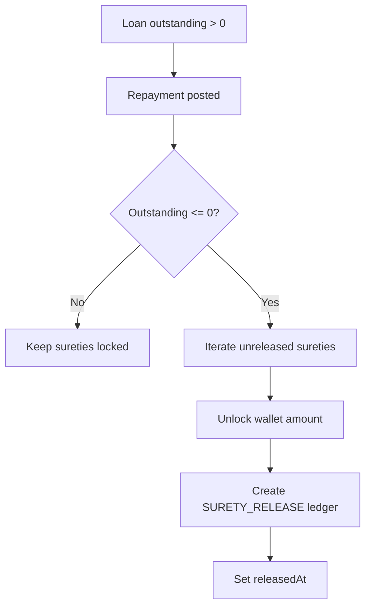

# Prompt 050: Loans Test Suite

## Status
COMPLETED

## Completed At
2026-07-22T12:00:00Z

## Summary
Documented the loan lifecycle tests covering creation, surety-backed disbursement, repayment, and automatic surety release once outstanding balance reaches zero.

## Covered File
`tests/loans.test.js`

## Lifecycle Coverage
1. create loan;
2. fail disbursement with no surety;
3. pledge surety;
4. disburse to borrower wallet;
5. repay partially;
6. repay fully;
7. verify surety released.

## Primary Test Flow
```js
const loan = await loans.createLoan({ proposerId: proposer.id, borrowerId: borrower.id, amount: '2000' });
await expect(loans.disburseLoan({ initiatorId: admin.id, loanId: loan.id })).rejects.toThrow(/Insufficient surety/);

const s = await surety.pledgeSurety({ initiatorId: pledger.id, loanId: loan.id, userId: pledger.id, amount: '2000' });
const disbursed = await loans.disburseLoan({ initiatorId: admin.id, loanId: loan.id });
const afterPartial = await loans.repayLoan({ initiatorId: borrower.id, loanId: loan.id, amount: '500' });
const afterFull = await loans.repayLoan({ initiatorId: borrower.id, loanId: loan.id, amount: String(afterPartial.outstanding) });
```

## Assertions
- loan receives an id on creation;
- disbursement requires pledged surety >= loan amount;
- borrower wallet balance increases after disbursement;
- outstanding drops after partial repayment;
- `repaidAt` is set after full repayment;
- related surety row gets `releasedAt`.

## Negative Cases
### Insufficient surety
```js
await expect(loans.disburseLoan({ initiatorId: admin.id, loanId: loan.id })).rejects.toThrow(/Insufficient surety/);
```

### Insufficient repayment funds
```js
await expect(loans.repayLoan({ initiatorId: borrower.id, loanId: loan.id, amount: '500' })).rejects.toThrow(/Insufficient funds/);
```

## Surety Release Path


## Reliability Notes
- borrower top-up is performed during the suite so full repayment can complete;
- direct database resets are used sparingly for setup control;
- teardown deletes sureties, loans, wallets, audits, and users.
