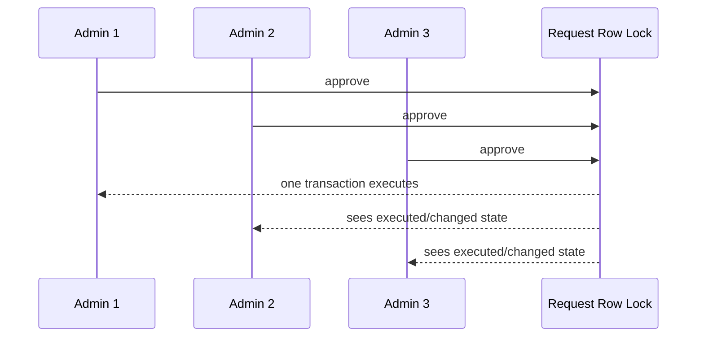

# Prompt 051: Concurrency Test Suite

## Status
COMPLETED

## Completed At
2026-07-22T12:00:00Z

## Summary
Documented the concurrency test that proves approval execution is single-winner under parallel submissions. The suite validates race-condition resistance, exact balances, and idempotent ledger/audit side effects.

## Covered File
`tests/approvals.concurrency.test.js`

## Scenario
A transfer request requiring two approvals is approved concurrently by three admins. The code uses a row lock plus idempotency checks so the request executes exactly once.

## Parallel Submission Pattern
```js
const calls = [
  approvals.approveRequest({ approverId: admin1.id, requestId: req.id, note: 'concurrent-1' }),
  approvals.approveRequest({ approverId: admin2.id, requestId: req.id, note: 'concurrent-2' }),
  approvals.approveRequest({ approverId: admin3.id, requestId: req.id, note: 'concurrent-3' }),
];

const results = await Promise.allSettled(calls);
```

## Race Prevention Mechanisms
In `src/modules/approvals.js` the execution path:
- locks the `Request` row with `FOR UPDATE`;
- re-checks status and approval count inside the transaction;
- checks for existing execution ledger entries;
- marks `executed` only once.

```js
const lockedRows = await tx.$queryRaw`
  SELECT * FROM "Request" WHERE id = ${requestId} FOR UPDATE
`;
```

## Assertions
- at least two approvals are fulfilled;
- request status becomes `EXECUTED`;
- `executed` flag is `true`;
- `executedAt` is set;
- payer balance is exactly `2000` from an initial `3000`;
- recipient balance is exactly `1000`;
- ledger count is exactly `2` (`EXECUTION_DEBIT` + `EXECUTION_CREDIT`);
- exactly one `REQUEST_EXECUTED` audit exists for that request.

## Flow


## Why It Matters
This suite protects against duplicate balance movement, duplicate ledger entries, and duplicate audit records during real multi-admin traffic.
