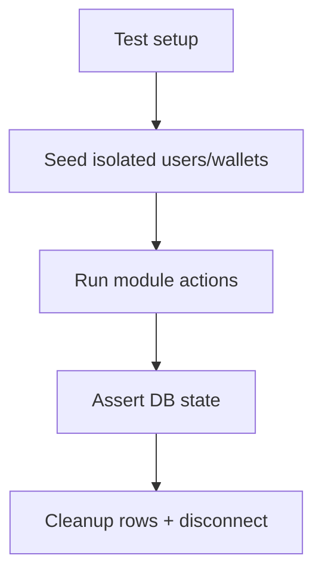

# Prompt 054: Integration Test Coverage Report

## Status
COMPLETED

## Completed At
2026-07-22T12:00:00Z

## Summary
Produced a coverage-oriented summary of the current integration-style test suite, highlighting what is already validated and what still needs additional depth.

## Modules Covered Today
- wallet operations (`tests/wallet.test.js`)
- request approvals and execution (`tests/approvals.test.js`)
- approval concurrency control (`tests/approvals.concurrency.test.js`)
- loan creation/disbursement/repayment (`tests/loans.test.js`)

## Current Strengths
- real Prisma/database interaction;
- transactional behavior under approval and repayment flows;
- concurrency safety on request execution;
- financial balance assertions rather than superficial status-only checks.

## Gaps Identified
- no dedicated auth HTTP test suite;
- no dedicated surety-only suite;
- no route-level/supertest coverage for Express middleware;
- limited ledger/audit assertions in wallet tests;
- no settings CRUD tests;
- no admin/member management endpoint tests;
- no report aggregation tests.

## Recommended Additional Cases
1. auth register/login/token middleware tests;
2. surety double-release and partial release tests;
3. audit log retrieval filters and pagination;
4. settings update + threshold effect tests;
5. route authorization matrix tests;
6. report endpoint aggregation correctness;
7. health check and global error handler tests.

## Reliability Notes
Because the suites use a shared database process, recommended Jest flags are:
- `--runInBand` to reduce inter-suite contention;
- `--forceExit` only as a last resort when connections are not cleaned up.

## DB State Management
The suites rely on:
- unique emails per run;
- explicit `beforeAll` setup;
- explicit `afterAll` cleanup;
- occasional direct Prisma resets for determinism.

## Coverage Posture
The codebase has solid core coverage for wallet, approvals, and loans, but still needs route/middleware/auth/reporting suites for broader release confidence.
