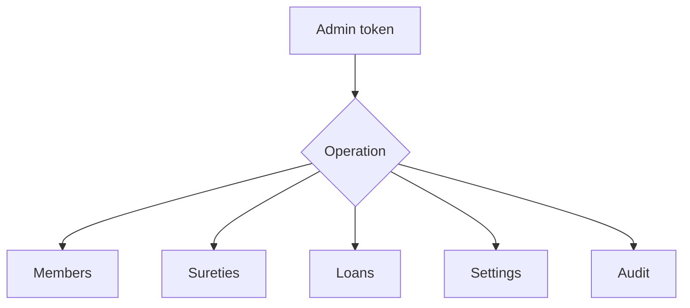

# Prompt 055: Admin Operations Module

## Status
COMPLETED

## Completed At
2026-07-22T12:00:00Z

## Summary
Defined the administrator capability set for managing members, operational settings, surety exceptions, loan disbursement, and audit visibility.

## Admin-Specific Operations
- promote member to admin;
- deactivate or suspend member;
- view all members;
- force-release surety;
- disburse loans;
- manage settings;
- view audit logs.

## Endpoint Design
```http
POST   /api/admin/members/:id/promote
POST   /api/admin/members/:id/deactivate
GET    /api/admin/members
POST   /api/admin/sureties/:id/release
POST   /api/loans/:id/disburse
GET    /api/settings
PATCH  /api/settings/:key
GET    /api/audit-logs
```

## Authorization Model
All endpoints require `authenticate` + admin role; highly sensitive actions can additionally require `isSuper`.

```js
router.post('/members/:id/promote', authenticate, ensureRole('ADMIN'), async (req, res, next) => {
  // optional: require req.user.isSuper
});
```

## Promote Member
Implementation should update `User.role` from `MEMBER` to `ADMIN` and write an audit row.

## Deactivate Member
Recommended fields: `isActive` or `status`. If suspension is introduced, auth middleware should reject suspended users at login/request time.

## Force-Release Surety
This action should call `releaseSurety()` with an override reason and audit metadata.

## Loan Disbursement
Current route already enforces admin-only disbursement:

```js
router.post('/:id/disburse', authenticate, ensureRole('ADMIN'), async (req, res, next) => {
  const loan = await disburseLoan({ initiatorId: req.user.id, loanId: req.params.id });
  res.json(loan);
});
```

## Admin Operations Map


## Implementation Notes
- audit every admin mutation;
- prefer explicit reason fields on destructive actions;
- keep member listing paginated once the user base grows.
