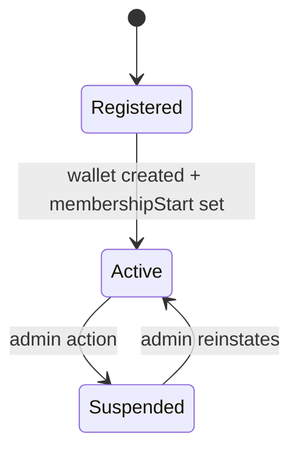

# Prompt 056: Member Management

## Status
COMPLETED

## Completed At
2026-07-22T12:00:00Z

## Summary
Defined the member-management lifecycle from registration through ongoing profile administration. The design covers status transitions, membership date tracking, admin oversight, and self-service updates.

## Member Lifecycle


## Current User Fields
From the Prisma model:
- `fullName`
- `email`
- `phone`
- `role`
- `isSuper`
- `membershipStart`
- `createdAt`

## Registration Behavior
`register()` already creates the member and their wallet and stamps `membershipStart`.

```js
const user = await prisma.user.create({
  data: {
    email,
    phone,
    fullName,
    password: hashed,
    role: 'MEMBER',
    membershipStart: new Date(),
  },
});
await prisma.wallet.create({ data: { userId: user.id, available: 0, locked: 0 } });
```

## Profile Management
### Member self-service
Recommended endpoints:
```http
GET   /api/members/me
PATCH /api/members/me
```

Allowed self-service fields:
- `fullName`
- `email`
- `phone`
- password change via separate secure flow

### Admin management
Recommended endpoint:
```http
GET /api/admin/members?page=1&pageSize=20
```

## Membership Start Tracking
`membershipStart` should represent when the member became active in the cooperative, not merely account creation time.

## Suspension Design
Recommended future addition:

```prisma
status String @default("ACTIVE")
```

Values:
- `ACTIVE`
- `SUSPENDED`
- `DEACTIVATED`

## Implementation Notes
- enforce unique email/phone during updates, not only registration;
- paginate admin member lists;
- audit profile changes and admin status changes.
