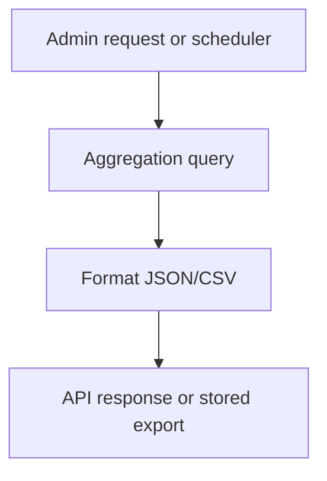

# Prompt 057: Reporting & Analytics Module

## Status
COMPLETED

## Completed At
2026-07-22T12:00:00Z

## Summary
Defined the reporting and analytics layer for administrators. The design covers wallet, loan, surety, and approval reporting with date-range filters, aggregation queries, and export-ready response formats.

## Report Types
- wallet summary
- loan portfolio
- surety exposure
- approval analytics

## Access Control
Reports are admin-only because they expose cross-member financial data.

```js
router.get('/reports/wallet-summary', authenticate, ensureRole('ADMIN'), async (req, res, next) => {
  res.json(await getWalletSummary(req.query));
});
```

## Aggregation Examples
### Wallet summary
```js
const summary = await prisma.wallet.aggregate({
  _sum: { available: true, locked: true },
  _count: { id: true },
});
```

### Loan portfolio
```js
const portfolio = await prisma.loan.aggregate({
  _sum: { amount: true, outstanding: true },
  _count: { id: true },
});
```

### Surety exposure
Group unreleased surety by loan or user.

```js
const exposure = await prisma.surety.groupBy({
  by: ['userId'],
  where: { releasedAt: null },
  _sum: { amount: true },
});
```

### Approval analytics
Track request counts by status and approval volume over time.

## Date Range Filtering
All reports should accept `dateFrom` and `dateTo` and apply them to `createdAt`, `disbursedAt`, or `repaidAt` depending on the dataset.

## Response and Export Formats
Primary API response is JSON; CSV export can be added via `?format=csv`.

```json
{
  "data": { "totalAvailable": "120000.00", "totalLocked": "18000.00", "walletCount": 320 },
  "filters": { "dateFrom": "2026-07-01", "dateTo": "2026-07-22" }
}
```

## Scheduled Reports Concept
For scheduled delivery, generate report payloads on a cron/queue worker and email or store them for admin download.



## Implementation Notes
- keep report queries read-only and paginated where row-level output is returned;
- aggregate with Prisma where possible, raw SQL when performance requires it;
- version report formats if external consumers depend on them.
