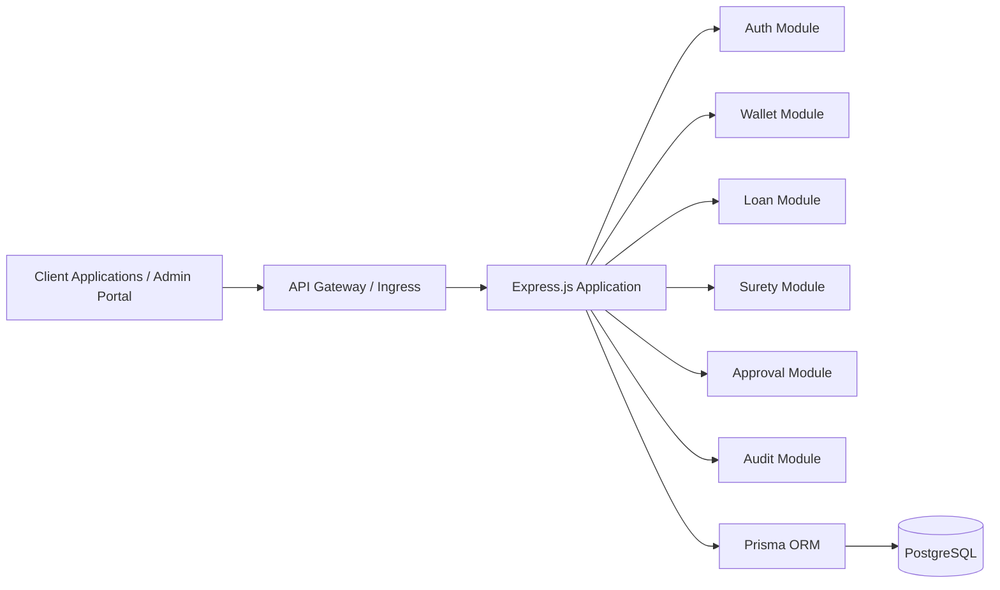
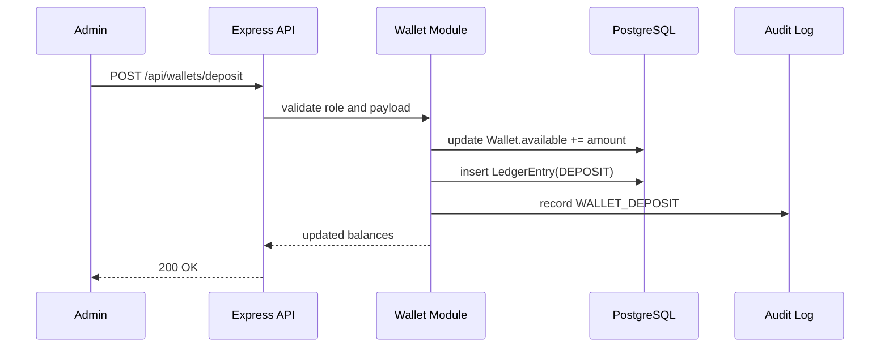
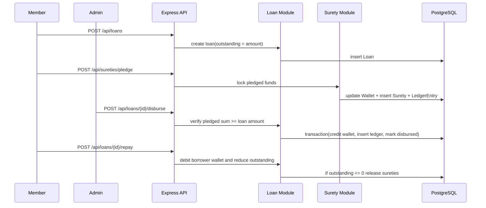
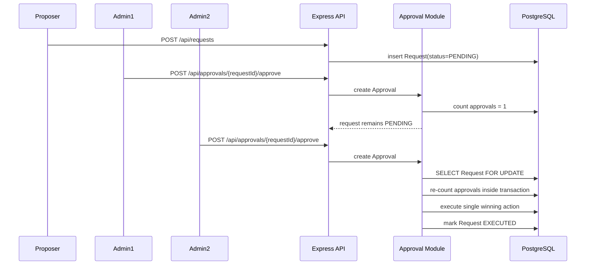

# Prompt 059: High-Level Design (HLD)

## Status
COMPLETED

## Completed At
2026-07-22T12:00:00Z

## Summary
High-level design for the cooperative platform covering architecture, components, key flows, dependencies, and scale strategy.

## System Architecture Overview
The platform is a stateless Express.js API deployed behind an API ingress layer and backed by PostgreSQL through Prisma ORM. Authentication is JWT-based. Business domains are separated into modules for auth, wallets, loans, surety, requests, approvals, and audit logging. The design favors atomic financial writes, row-level concurrency protection for sensitive execution paths, and operational simplicity for MVP.

### Architecture Principles
- **Stateless API tier** for horizontal scale.
- **Single source of truth** in PostgreSQL.
- **Business-rule enforcement in service modules**.
- **Immutable financial evidence** through ledger + audit logs.
- **Least privilege** via role-based access control.

## Component Diagram

## Major Components
| Component | Responsibility |
| --- | --- |
| Client | Sends authenticated API requests for member and admin actions |
| API Gateway | TLS termination, rate limiting, WAF policy, routing, observability enrichment |
| Express App | REST API host, request validation, auth middleware, domain orchestration |
| Prisma ORM | Data access abstraction, transactions, raw SQL for atomic balance updates |
| PostgreSQL | System of record for users, wallets, ledger, requests, approvals, loans, sureties, audit logs, settings |
| Monitoring Stack | Metrics, logs, tracing, alerts |

## Key Design Decisions
1. **JWT for authentication**
   - Keeps API tier stateless.
   - Simplifies scale-out and zero-downtime deployment.
2. **PostgreSQL as transactional core**
   - Strong consistency is required for balances, approvals, and loan state.
3. **Prisma + targeted raw SQL**
   - Prisma provides maintainability; raw SQL is used where atomic `UPDATE ... RETURNING` or `FOR UPDATE` locking is essential.
4. **Double-entry style ledger evidence**
   - Every financial mutation is traceable via reference, type, before balance, and after balance.
5. **Threshold-based approvals**
   - Sensitive actions are executed only after configurable admin consensus.
6. **Audit trail on privileged events**
   - Security and operational review depend on structured audit records.

## Data Flow Diagrams
### Deposit Flow

### Loan Lifecycle Flow

### Approval Flow

## External Dependencies
| Dependency | Usage |
| --- | --- |
| PostgreSQL | Primary transactional datastore |
| Node.js 20 runtime | Application execution environment |
| Prisma Client | ORM and transaction boundary |
| JSON Web Tokens | Access and refresh token handling |
| bcrypt | Password hashing |
| GitHub Actions | CI/CD orchestration |
| AWS / Kubernetes platform | Production deployment targets |
| Prometheus / Grafana / CloudWatch / ELK | Observability |

## Scalability Approach
### API Tier
- Run multiple stateless API replicas behind a load balancer.
- Use HPA/ECS autoscaling based on CPU, memory, and request latency.
- Enforce idempotency and concurrency safety at the database layer to avoid cross-node race conditions.

### Database Tier
- Start with a single PostgreSQL primary for MVP.
- Add read replicas for analytics and reporting workloads.
- Tune connection pools and use PgBouncer/RDS Proxy when concurrent connection growth becomes material.

### Future Enhancements
- Introduce Redis for short-lived caching and configuration reads.
- Move long-running reporting and notifications to async workers.
- Separate audit and analytics pipelines from transactional workloads.

## Availability & Resilience Considerations
- Multi-AZ database deployment for production.
- Rolling or blue/green API deployments.
- Daily backups and PITR enabled.
- Health checks at load balancer, orchestration, and app layers.
- Alerting on error rate, latency, saturation, and replication lag.
