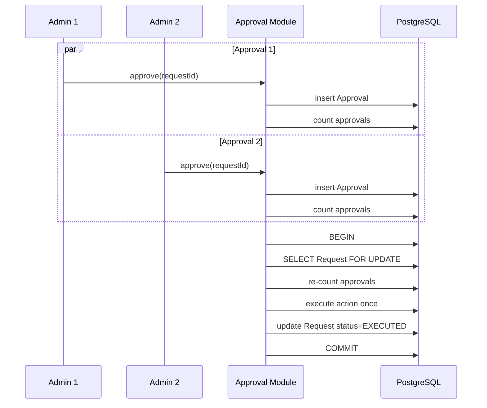
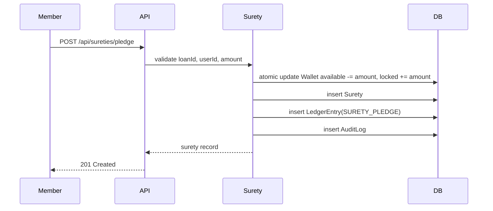
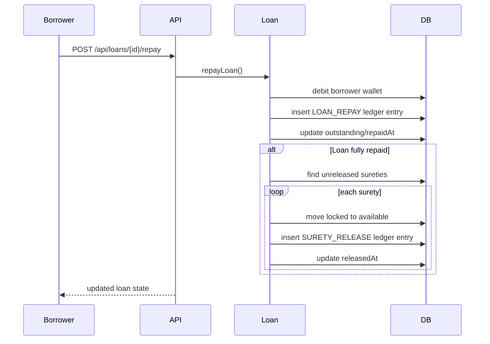

# Prompt 060: Low-Level Design (LLD)

## Status
COMPLETED

## Completed At
2026-07-22T12:00:00Z

## Summary
Low-level design describing module boundaries, core function signatures, database structures, algorithms, API details, and sequence diagrams.

## Module-Level Component Breakdown
| Module | Files | Responsibilities |
| --- | --- | --- |
| Auth | `src/modules/auth.js`, `src/middleware/auth.js`, `src/routes/auth.js` | registration, login, JWT issuance, bearer-token authentication, role gating |
| Wallet | `src/modules/wallet.js`, `src/routes/wallets.js` | balances, deposits, withdrawals, lock/unlock flows, ledger posting |
| Loans | `src/modules/loans.js`, `src/routes/loans.js` | loan creation, disbursement, repayment, surety release on settlement |
| Surety | `src/modules/surety.js`, `src/routes/surety.js` | pledge and release of locked collateral |
| Requests | `src/modules/requests.js`, `src/routes/requests.js` | creation and retrieval of approval-bound requests |
| Approvals | `src/modules/approvals.js`, `src/routes/approvals.js` | threshold-based approval and rejection workflows |
| Audit | `src/modules/audit.js` | structured audit event persistence |
| Infrastructure | `src/lib/prisma.js`, `src/server.js`, `src/middleware/errorHandler.js` | Prisma client, Express bootstrap, error serialization |

## Core Function Signatures
```js
// auth.js
async function register({ email, phone, fullName, password })
async function login({ email, password })
function signAccess(user)
function signRefresh(user)

// middleware/auth.js
async function authenticate(req, res, next)
function ensureRole(role)

// wallet.js
async function getBalance(userId)
async function deposit({ initiatorId, userId, amount, reference = 'deposit', type = 'DEPOSIT' })
async function withdraw({ initiatorId, userId, amount, reference = 'withdraw', type = 'WITHDRAW' })
async function lockFunds({ initiatorId, userId, amount, reference = 'lock', type = 'LOCK' })
async function unlockFunds({ initiatorId, userId, amount, reference = 'unlock', type = 'UNLOCK' })

// requests.js
async function createRequest({ proposerId, title, description, amount = null, metadata = {} })
async function getRequest(id)
async function listRequests({ where = {}, take = 50 })
async function getApprovalThreshold()

// approvals.js
async function approveRequest({ approverId, requestId, note = null })
async function rejectRequest({ approverId, requestId, note = null })

// loans.js
async function createLoan({ proposerId, borrowerId, amount, termMonths = null, metadata = {} })
async function disburseLoan({ initiatorId, loanId })
async function repayLoan({ initiatorId, loanId, amount })
async function getLoan(id)
async function listLoans({ where = {}, take = 50 })

// surety.js
async function pledgeSurety({ initiatorId, loanId, userId, amount, reference = 'SURETY_PLEDGE' })
async function releaseSurety({ initiatorId, suretyId, amount = null, reference = 'SURETY_RELEASE' })
```

## Database Table Designs
### Entity Overview
| Table | Purpose | Key Relationships |
| --- | --- | --- |
| User | member/admin identity | 1:1 Wallet, 1:M Request(proposer), 1:M Approval |
| Wallet | available and locked balance per user | unique FK to User |
| LedgerEntry | financial evidence trail | optional user references by debit/credit IDs |
| Request | privileged action envelope | proposer -> User, approvals -> Approval[] |
| Approval | admin decision on request | FK to Request and User |
| Loan | borrower obligation | borrower -> User |
| Surety | pledged collateral lock | logical relation to Loan and User |
| AuditLog | immutable audit evidence | optional initiatorId |
| Setting | runtime configuration | unique key/value |

### Important Schema Notes
- The authoritative Prisma schema stores request execution data in `type`, `metadata`, `status`, `executed`, and `executedAt`.
- Runtime module code currently enriches request semantics via metadata payload.
- `Surety` is modeled without explicit Prisma relation fields in the current schema; referential integrity is still expected at application level.

## Algorithm Descriptions
### Approval Threshold Algorithm
1. Load request by `requestId`.
2. Reject if request does not exist, is not `PENDING`, or approver is the proposer.
3. Reject duplicate approval from same approver.
4. Insert approval record.
5. Count approvals and fetch configured threshold.
6. If count is below threshold, stop.
7. Start database transaction.
8. Lock request row with `SELECT ... FOR UPDATE`.
9. Re-check request status and execution flag.
10. Re-count approvals inside transaction.
11. If threshold still satisfied, execute underlying action exactly once.
12. Mark request `EXECUTED`, set timestamp, and write audit events.

### Concurrency Lock Algorithm
Used for request execution and wallet debit safety.

- **Wallet debits** use atomic SQL updates with a guard clause:
  `UPDATE Wallet SET available = available - amount WHERE userId = ? AND available >= amount RETURNING *`
- **Single-winner request execution** uses row-level locking on `Request`.
- **Idempotency** is enforced by checking `executed`, status transitions, and pre-existing ledger entries by `reference` + type.

### Loan Disbursement Algorithm
1. Fetch loan; reject if absent or already disbursed.
2. Aggregate unreleased sureties for loan.
3. Compare pledged sum to loan amount.
4. In a transaction, credit borrower wallet, insert `LOAN_DISBURSE` ledger entry, mark `disbursedAt`, and audit.

### Loan Repayment Algorithm
1. Fetch loan; reject if not found or not disbursed.
2. Atomically debit borrower wallet.
3. Insert `LOAN_REPAY` ledger entry.
4. Reduce `outstanding` and set `repaidAt` when cleared.
5. If fully repaid, iterate unreleased sureties and move locked funds back to available.

## API Endpoint Specifications
| Endpoint | Method | Auth | Description |
| --- | --- | --- | --- |
| `/api/auth/register` | POST | No | Register member and auto-provision wallet |
| `/api/auth/login` | POST | No | Return access token, refresh token, and user summary |
| `/api/wallets/balance` | GET | Member/Admin | Fetch own wallet balance |
| `/api/wallets/deposit` | POST | Admin | Deposit to target user wallet |
| `/api/wallets/withdraw` | POST | Member/Admin | Withdraw from actor wallet |
| `/api/wallets/transfer` | POST | Member/Admin | Canonical enterprise contract; typically implemented via request + approvals |
| `/api/loans` | POST/GET | Member/Admin | Create and list loans |
| `/api/loans/{id}/disburse` | POST | Admin | Disburse approved and adequately secured loan |
| `/api/loans/{id}/repay` | POST | Member/Admin | Repay outstanding loan amount |
| `/api/sureties/pledge` | POST | Member/Admin | Lock funds as collateral |
| `/api/sureties/release` | POST | Admin | Unlock pledged funds |
| `/api/requests` | POST/GET | Member/Admin | Submit and list governed requests |
| `/api/requests/{id}` | GET | Member/Admin | Retrieve request with approvals |
| `/api/approvals/{requestId}/approve` | POST | Admin | Record admin approval |
| `/api/approvals/{requestId}/reject` | POST | Admin | Reject request |

## Sequence Diagrams
### Concurrent Approval and Single Execution


### Surety Pledge Flow


### Loan Repayment with Auto-Release

