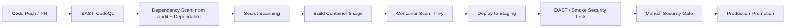

# Prompt 068: DevSecOps Pipeline Design

## Status
COMPLETED

## Completed At
2026-07-22T12:00:00Z

## Summary
DevSecOps design integrating SAST, dependency scanning, container scanning, secret detection, DAST, compliance gates, and security response triggers.

## Pipeline Stages

## Controls by Stage
### 1. SAST Integration
- Run **CodeQL** on pull requests and `main`.
- Block merge on high-confidence critical/high findings.
- Track remediation SLA by severity.

### 2. Dependency Scanning
- Run `npm audit --production` in CI.
- Enable **Dependabot** for npm and GitHub Actions updates.
- Require review for major-version upgrades and any security patch affecting auth, crypto, or ORM layers.

### 3. Container Scanning
- Scan built images with **Trivy** before push and before promotion.
- Fail pipeline on critical vulnerabilities unless explicitly risk-accepted.
- Store scan SARIF or artifact outputs for auditability.

### 4. Secret Scanning
- Enable repository secret scanning and push protection.
- Scan IaC, workflow files, `.env` examples, and test fixtures for hard-coded secrets.
- Treat leaked production credentials as incident-response triggers.

### 5. DAST Approach
- Run lightweight authenticated DAST against staging.
- Validate rate limiting, header policy, auth failures, missing authorization, and common OWASP API risks.
- Maintain a curated regression pack for critical routes: login, deposit, withdraw, approvals, loans.

### 6. Compliance Gates
| Gate | Blocking Rule |
| --- | --- |
| CodeQL | No open critical/high issues introduced by change |
| Dependency scan | No critical package advisories in deployed dependency graph |
| Secret scan | Zero detected secrets in tracked files |
| Container scan | No critical image findings; medium/high require review threshold |
| DAST | No exploitable auth, injection, or transport-control regressions |
| Manual review | Security sign-off required for auth, approval, wallet, or loan logic changes |

## Security Review Process
1. Developer opens PR.
2. Automated security checks run.
3. Reviewer validates business-logic security for wallet, approval, and loan flows.
4. Security reviewer signs off on high-risk changes.
5. Production promotion requires explicit approval and clean pipeline state.

## Incident Response Triggers
- Secret leak in repository or CI artifact.
- New critical CVE in runtime image or direct dependency.
- CodeQL finding indicating auth bypass, injection, or unsafe deserialization.
- DAST finding of broken access control or missing TLS/security headers.
- Repeated abnormal admin activity detected in audit logs.

## Recommended GitHub Actions Stack
- `github/codeql-action` for SAST.
- `actions/dependency-review-action` and `npm audit` for dependency risk.
- `aquasecurity/trivy-action` for container images and filesystem scan.
- GitHub Advanced Security or equivalent for secret scanning.
- Environment protection rules for manual security approvals.
