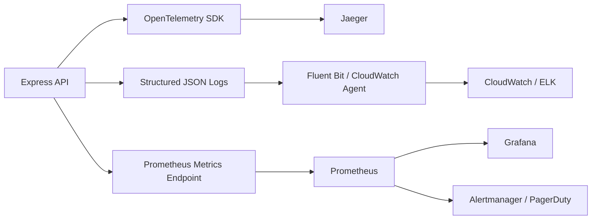

# Prompt 069: Monitoring & Observability Stack

## Status
COMPLETED

## Completed At
2026-07-22T12:00:00Z

## Summary
Observability design covering metrics, structured logging, tracing, alerting, dashboards, and service objectives for the cooperative platform.

## Monitoring Architecture

## Metrics
### Prometheus + Grafana
Track at minimum:
- request count by route/method/status
- response time percentiles (p50/p95/p99)
- error rate by endpoint
- database connection pool utilization
- active DB transactions and lock wait time
- approval execution count and failure rate
- wallet deposit/withdraw throughput
- loan disbursement and repayment volume

## Logging
- Emit **structured JSON logs** using `winston`.
- Ship logs to **CloudWatch** or **ELK**.
- Include request correlation IDs and user/action metadata.
- Separate application, access, audit, and security logs.

## Tracing
- Instrument the API with **OpenTelemetry**.
- Export traces to **Jaeger**.
- Trace spans should cover HTTP request, auth middleware, Prisma queries, and domain workflows such as approvals and repayments.

## Alerting
### PagerDuty Integration
Route alerts by severity:
- **P1**: API unavailable, database unavailable, sustained 5xx spike.
- **P2**: high latency, DB pool exhaustion, failed loan disbursement surge.
- **P3**: degraded non-critical metric or unusual background error trend.

## Key Dashboards
| Dashboard | Purpose |
| --- | --- |
| API Health | uptime, latency, request volume, 4xx/5xx split |
| Wallet Operations | deposits, withdrawals, failed debits, available vs locked anomalies |
| Loan Portfolio | active loans, outstanding amount, disbursement throughput, repayment completion |
| Approval Governance | pending requests, time-to-approve, threshold breaches, rejection rate |
| Database Health | connections, CPU, storage, slow queries, lock contention |

## SLO / SLA Targets
| Metric | Target |
| --- | --- |
| Availability SLO | 99.9% monthly |
| Read endpoint latency | <200 ms p95 |
| Write endpoint latency | <500 ms p95 |
| Error budget | 0.1% monthly downtime budget |
| Audit event durability | 100% of privileged actions logged |
| Alert acknowledgement | P1 within 15 minutes |

## Operational Recommendations
- Create synthetic probes for `/` and one authenticated read endpoint.
- Correlate trace IDs into logs for rapid incident triage.
- Retain enough metrics history for quarter-over-quarter trend analysis.
- Define capacity alerts before resource saturation becomes user visible.
